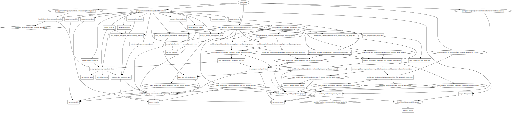

# Owlet: Modest Data Project Template

This project aims to create a template for "modest data" projects (as opposed to _big data_).
But this project also aims to use technology to make the transition to a big data projects easier.

Why **Owlet**? Well baby owls are called Owlets. These projects start small and should sleep most of the time and wake a couple of times of day like owls at dawn and dusk. With the idea these projects can leave the nest and fly on their own later.

## Project values

 - Minimise financial costs, and total project running costs to be less than $10 / month (ideally $1/month)
 - Designed for infrequent (once a day or once a week usage) use and scale to zero
 - Use least amount of technology components, components used should have wide adoption and community support
 - Technology should gateway enable big data projects
 - Getting started should be my data model, my credentials and project name and 2-3 commands.
 - Avoid technologies that mean lock-in (like AWS SAM)

## Architecture in a nutshell

 - Infra-as-Code: Terraform
 - Frontend: React static hosting on S3 (Costs: S3 + CloudFront if using CDN)
 - Backend: API Gateway + Python Lambda + JWT Auth
 - Auth: Cognito using OAuth2 spec (50,000 active users / month in free tier)
 - Data storage:
   - Aurora Serverless?
   - Athena + S3 + Parquet?
   - Python Lambda + S3 + Deltalake?
   - DynamoDb?


Ideally object storage and parquet like storage seems to offer good compression, good metadata and the ability to easily ingest from other sources later like:
 - SageMaker
 - Databricks
 - Snowflake


# Speed run

The following commands are my code snippet scratch pad do perform a full run through.

It also keeps the onboarding cognitive load front and center. 

**I aim to keep this small.**

```bash
# Setup dev environment and tooling
python3 ./tasks.py init

# Build backend
inv build

# Setup infra and backend
inv tfup

# Build and deploy static site
inv uibuild uideploy

# Speen run
inv build tfup uibuild uideploy

open "https://$(terraform -chdir=infra output -raw website_endpoint)"

# Clean up speed run
inv uidestroy tfdn clean

# Housekeeping
inv tffmt
terraform -chdir=infra graph | dot -Tsvg > graph.svg
```

```sh
λ inv --list
Available tasks:

  build       For each model in data_model.yml build backend lambda artifacts.
  clean       Clean local build artifacts.
  format      Autoformat code and sort imports.
  lint        Run linting and formatting checks.
  test        Run pytest.
  tfdn        Tear down terraform described state.
  tffmt       Format and validate terraform code.
  tfup        Apply terraform modules to deploy updated state.
  uibuild     Build UI Frontend artifacts locally.
  uicreate    Initialise UI Frontedn from scratch.
  uideploy    Upload built UI frontend components.
  uidestroy   Tear down deployed frontend artifacts.
  uiserve     Locally serve frontend UI for development purposes.
```

## Diagram



## Pricing

 - Cognito: 
    - Free tier: 50,000 active users / month
    - Tier 1: 50,001-100,000 $0.0055/ MAU (eg $5.50 / 1000 MAU over 50k)
 - S3 Storage:
    - Standard $0.025/Gb/Month (Free Tier 5Gb free first 12 months)
 - Cloudfront:
    - Free only for first 12 months of your account
    - Just avoid using it initially
    - 800,000 HTTPS requests per $1 (@ $0.0125 / 10,000 request / month)
    - 8.7Gb data transfer per $1 (@ $0.114/Gb/month)
    - eg $0.02 ~ 8k requests @ 110kb data transfer each
 - API Gateway:
    - First 300M request / month =  $1.29 / million =  up to $387
    - 300M+ = $1.18 / million
    - 1000 requests = $0.00129
 - AWS Lambda:
    - Duration $0.0000166667 / GB-second
      - eg 6 seconds @ 128Mb = $0.0000125
      - Free tier = 400,000 Gb-seconds
        - eg At 128Mb that is 37 free days of lambda compute time per month
    - Requests $0.20 / 1M requests
      - eg 1000 requests = $0.0002
      - Free tier = 1M requests
 - DynamoDB:
   - Free Tier: 25Gb storage, 2.5M stream read requests, 1Gb data transfer out

# TODO List

API:
 - Add /profile route to give logged in user details about themself and API access

Frontend:

 - Watch freeCodeCamp React tutorials
 - Watch Material UI tutorials
 - Create protected routes for each concept in data model
 - Tidy up login flow, possibly use  Material UI component?

 - Create data form accessible once logged in
 - Have React app securely query Lambda API with Auth credentials from session cookie
 - All data concepts should have an automatic HTML form to submit data one entry at a time.
 - All data concepts should have a drag and drop file upload for mass data entry

Storage:

 - Research data storage options:
   - Python Lambda + S3 + Parquet with PyArrow?
   - Create API handlers to GET/POST data to/from parquet

Misc:
 - Add authorization code grant flow 
 - Use terraform workspaces to create dev and prod instances
 - What would a developer portal look like for direct API access?
 - Generate Swagger docs for API and publish under the /api/docs route.


# Learning Resources:

Key resources:

 - Follow along with this [tutorial on HashiCorp Learn](https://learn.hashicorp.com/tutorials/terraform/lambda-api-gateway?in=terraform/aws).
 - Added Cognito Authorizer inspired by this video: [https://www.youtube.com/watch?v=o7OHogUcRmI](https://www.youtube.com/watch?v=o7OHogUcRmI)
 - Added React static site based on this tutorial: [https://learn.hashicorp.com/tutorials/terraform/cloudflare-static-website?in=terraform/aws](https://learn.hashicorp.com/tutorials/terraform/cloudflare-static-website?in=terraform/aws)
 - 2021 React Crash Course (2h) [https://www.youtube.com/watch?v=w7ejDZ8SWv8](https://www.youtube.com/watch?v=w7ejDZ8SWv8])
 - React Protected routes with Cognito signin:
    - [https://www.youtube.com/watch?v=Y0-qdp-XBJg](https://www.youtube.com/watch?v=Y0-qdp-XBJg)
    - [https://www.youtube.com/playlist?list=PLDckhLrNepPR8y-9mDXsLutiwsLhreOk1](https://www.youtube.com/playlist?list=PLDckhLrNepPR8y-9mDXsLutiwsLhreOk1)
    - [https://www.youtube.com/playlist?list=PLaxxQQak6D_eARpHp6JdMq3rvD5A-WU9N](https://www.youtube.com/playlist?list=PLaxxQQak6D_eARpHp6JdMq3rvD5A-WU9N)
 - https://www.youtube.com/playlist?list=PLVLP4csKTwDbhEybIwYk_4pmygVYTA8po
 - https://www.youtube.com/playlist?list=PLVLP4csKTwDYuaPo83MABH-VQY9xp1Gc4

More resources:

 - Terraform crash course: https://www.youtube.com/watch?v=SLB_c_ayRMo
 - Terraform tutorials: https://www.youtube.com/playlist?list=PL8HowI-L-3_9bkocmR3JahQ4Y-Pbqs2Nt
 - Terraform in Action Book: https://www.manning.com/books/terraform-in-action
